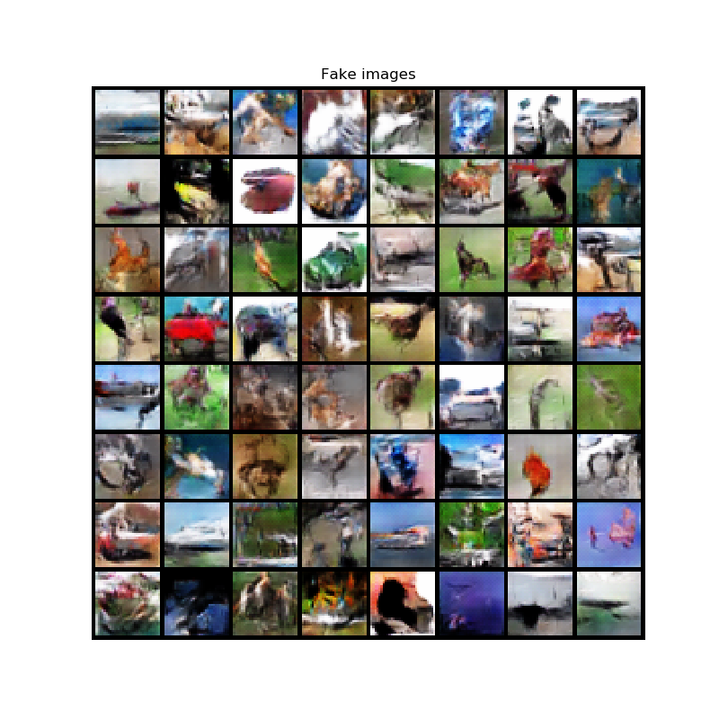

## DCGAN For CIFAR10

  A simple implementation of DCGAN on CIFAR10 dataset.

#### Usage

1. Install all requirements by

   `pip install -r requirements.txt`

2. Run the following command to train the generator and discriminator. The dataset will be downloaded automatically.

   `python -u main.py`

3. Visualize the fake images by setting **is_train = False** in **main.py**.

4. To visualize the performance in training, run the following command.

   `tensorboard --logdir=/your/summary/path`

#### Performance

  After training for 30 epochs on CIFAR10 dataset with the batch size of 128:

#### Reference

1. https://github.com/Ksuryateja/DCGAN-CIFAR10-pytorch
2. https://pytorch.org/tutorials/beginner/dcgan_faces_tutorial.html#training
3. https://medium.com/@stepanulyanin/dcgan-adventures-with-cifar10-905fb0a24d21
4. [DCGAN paper](https://arxiv.org/pdf/1511.06434.pdf)

